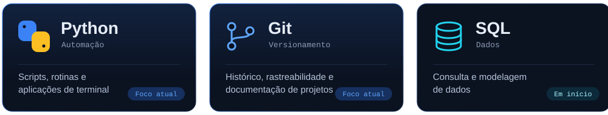
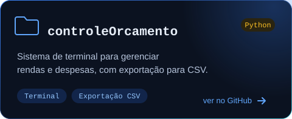
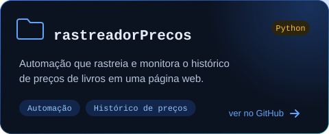

  

&nbsp;&nbsp;

&nbsp;&nbsp;

 

Estudante de Engenharia de Software na UNICEPLAC e estagiário de Projetos e QA. Atuo na análise de sistemas e na verificação da confiabilidade de software, com foco em converter processos manuais em rotinas automatizadas e reproduzíveis.

Meu objetivo de longo prazo é me tornar Engenheiro MLOps. O caminho é deliberado: automação, engenharia de dados e DevOps, nessa ordem, com cada etapa construindo a base técnica da seguinte.

 

Cada etapa fornece o insumo da seguinte. A automação torna processos reproduzíveis; a engenharia de dados garante informação organizada e confiável; o DevOps estabelece entrega e operação contínuas; o MLOps integra as três camadas para colocar modelos de IA em produção de forma sustentável.

 

 

 

